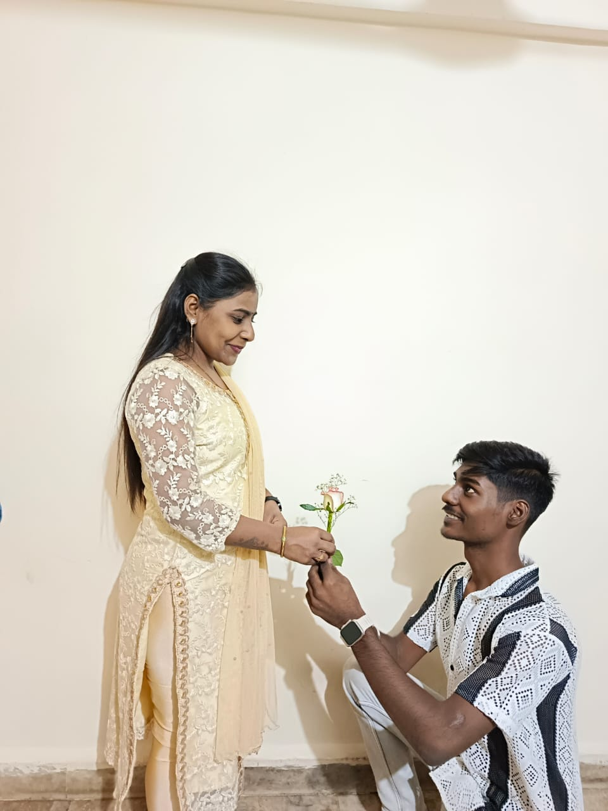
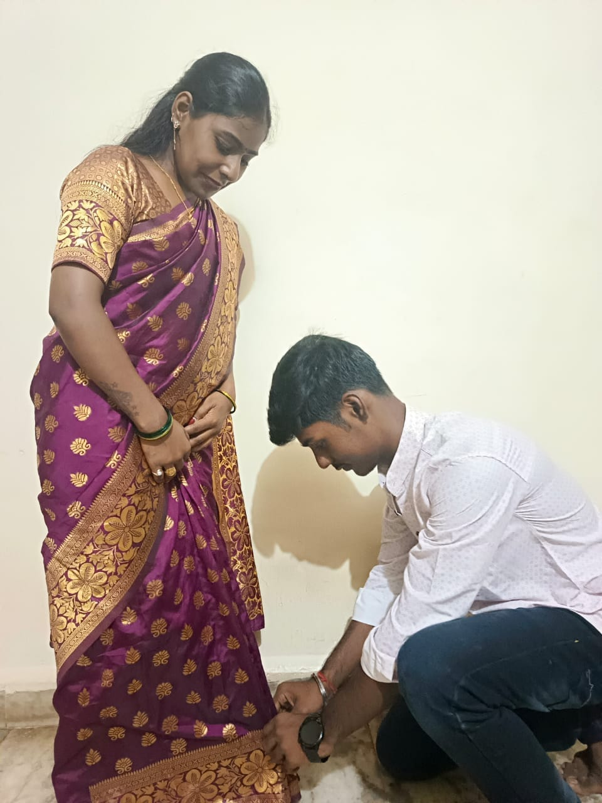
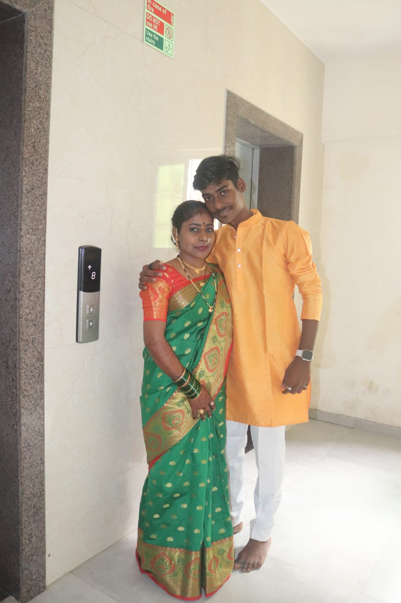

<!DOCTYPE html>
<html lang="en">
<head>
<meta charset="UTF-8">
<meta name="viewport" content="width=device-width, initial-scale=1.0">
<title>For Badi Waali Didi 👑</title>

</head>
<body>

  <header>
    <svg class="crest" viewBox="0 0 110 110" fill="none">
      <rect x="10" y="10" width="90" height="90" rx="4" fill="none" stroke="#D4AF6A" stroke-width="1" opacity="0.4"/>
      <path d="M55 20 L64 42 L88 42 L68 56 L76 78 L55 64 L34 78 L42 56 L22 42 L46 42 Z" fill="#D4AF6A" opacity="0.9"/>
      <circle cx="55" cy="55" r="7" fill="#2E0B14"/>
    </svg>
    <h1>Happy Rakhi, <em>Badi Waali Didi</em></h1>
    
Aap toh hamesha bhaari padi ho, chahe umar ho ya pyaar — aapke bhai ki taraf se!

  </header>

  
Pics

  

    
of you two 🤝

    
from home 🏡

    
favorite memory ✨

  

  
Quick Quiz

  <!-- QUESTION 1 (Visible at start) -->
  

    
Q1

    
Ghar mein sabse zyada order kaun chalati hai?

    

      <button class="opt" data-fb="Bilkul sahi. Badi Waali Didi ka hukum chalta hai! 👑">Meri Badi Waali Didi</button>
      <button class="opt" data-fb="Nice try, par asli boss toh koi aur hai 😄">Papa</button>
      <button class="opt" data-fb="Haha, sochne mein galti nahi hai, par nahi 😉">Main khud</button>
    

    

    <button class="next-btn">Next →</button>
  

  <!-- QUESTION 2 (Hidden) -->
  

    
Q2

    
Chhote bhai ki sabse zyada daant kis baat par padi hai?

    

      <button class="opt" data-fb="Classic. Yeh toh har baar hota tha! 😂">Der raat tak jagna</button>
      <button class="opt" data-fb="Yeh bhi sach hai x) 😅">Kaam time pe na karna</button>
      <button class="opt" data-fb="In sab ka combo chal raha tha! 🤣">In sab ka combo</button>
    

    

    <button class="next-btn">See Message →</button>
  

  <!-- EMOTIONAL CLOTHES MESSAGE SCREEN (Hidden) -->
  

    
"Wapis mere kapde chupalo please taaki mai kahi nhi jau bss apki kod me soya rahu 🥺🥺"

    <button class="next-btn" id="to-final-btn" style="display: block; margin: 25px auto 0; padding: 10px 24px;">Tap here, one last thing... 👀</button>
  

  <!-- FINAL THANK YOU SCREEN (Hidden) -->
  

    
"Thank you hamesha mera khayal rakhne ke liye aur har mushkil mein sahi rasta dikhane ke liye. Happy Rakhi Didi!"

    <button class="heart-btn">Send Love ❤️</button>
    
Hugs incoming! 🤗✨

  

</body>
</html>
